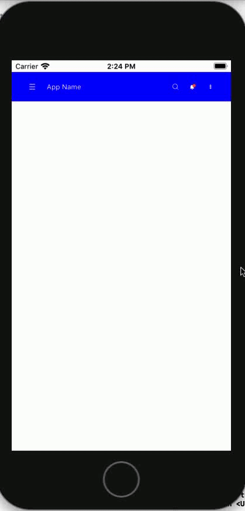

# ASAppBar

[](https://travis-ci.org/amitpstu1@gmail.com/ASAppBar)
[](https://cocoapods.org/pods/ASAppBar)
[](https://cocoapods.org/pods/ASAppBar)
[](https://cocoapods.org/pods/ASAppBar)

Screenshots
---------


    
## Import Statement
```swift
import ASAppBar
```

## Outlet Initialization
```swift
@IBOutlet weak var appBar: ASAppBarClassic!
```

## Variables
```swift
let appBarIconPadding = CGSize(width: 10, height: 10)
let leftBarMultiplierH: CGFloat = 0.6
let leftBarMultiplierV: CGFloat = 0.6
let rightBarMultiplierH: CGFloat = 0.6
let rightBarMultiplierV: CGFloat = 0.6

let titleView = ASAChangableView("App Name", {self.initTitleLabel()},{self.initTitleLabel()})
let menuView = ASAChangableView("Menu", {UIImageView(image: UIImage(named: "menu"))},{UIImageView(image: UIImage(named: "menu"))})
let moreView = ASAChangableView("More", {UIImageView(image: UIImage(named: "moreIcon"))},{UIImageView(image: UIImage(named: "moreIcon"))})
let notificationView = ASAChangableView("Notification", {UIImageView(image: UIImage(named: "notification"))},{UIImageView(image: UIImage(named: "notification"))})
let searchView = ASAChangableView("Search", {UIImageView(image: UIImage(named: "search"))},{self.initSearchBar()})
let showMoreProps = ASADropDownProp(UIFont.systemFont(ofSize: 15), UIColor.black, UIColor.lightGray, UIColor.lightGray)
```

## Set Left Item
```swift
// id(String?), changableView(ASAChangableView?), multiplier(ASAMultiplier?), iconPadding(CGSize), addToBar(Bool), closure(ASAViewClosure?)
// 'id' is for unique identification
// through 'changableView', you can change two views by one-click event
// through 'multiplier', you can set item size ratio with respect to parents view
// through 'iconPadding', you can set item subview size ratio with respect to parents view
// through 'addToBar', you can set it into appbar(Note: addToBar=false for add to more dropdown section)
// through 'closure', you can set event
self.appBar
.setBackgroundColor(UIColor.blue)
.setLeftView("0", menuView, ASAMultiplier(leftBarMultiplierH, leftBarMultiplierV), appBarIconPadding, true, { (appbar, subView, isOn) in print("isOn: \(isOn)") })
.setLeftView("1", titleView, ASAMultiplier(2, 1), appBarIconPadding, false, true, { (appbar, subView, isOn) in print("isOn: \(isOn)")})
```

## Set Right Item
```swift
self.appBar
.setRightView("3", notificationView, ASAMultiplier(rightBarMultiplierH, rightBarMultiplierV), appBarIconPadding, true, { (appbar, subView, isOn) in print("isOn: \(isOn)")})
.setRightView("4", searchView, ASAMultiplier(rightBarMultiplierH, rightBarMultiplierV), appBarIconPadding, true, true, { (appbar, subView, isOn) in print("isOn: \(isOn)"); appbar.setMultiplier(1, (isOn ? ASAMultiplier(0, 0) : ASAMultiplier(2, 1))) })
.setRightView("5", menuView, ASAMultiplier(rightBarMultiplierH, rightBarMultiplierV), appBarIconPadding, false, { (appbar, subView, isOn) in print("isOn: \(isOn)")})
.setRightView("6", notificationView, ASAMultiplier(rightBarMultiplierH, rightBarMultiplierV), appBarIconPadding, false, { (appbar, subView, isOn) in print("isOn: \(isOn)")})
.setRightView("7", menuView, ASAMultiplier(rightBarMultiplierH, rightBarMultiplierV), appBarIconPadding, false, { (appbar, subView, isOn) in print("isOn: \(isOn)")})
```

## Set Expandable Right Item
```swift
self.appBar
.setRightView("4", searchView, ASAMultiplier(rightBarMultiplierH, rightBarMultiplierV), appBarIconPadding, true, true, { (appbar, subView, isOn) in print("isOn: \(isOn)"); appbar.setMultiplier("1", (isOn ? ASAMultiplier(0, 0) : ASAMultiplier(2, 1))) })
```

## Set Expandable Right Item
```swift
self.appBar
.setRightView("4", searchView, ASAMultiplier(rightBarMultiplierH, rightBarMultiplierV), appBarIconPadding, true, true, { (appbar, subView, isOn) in print("isOn: \(isOn)"); })
```

## Set Right Item And It's Event Change Other Size By Id
```swift
self.appBar
.setRightView("4", searchView, ASAMultiplier(rightBarMultiplierH, rightBarMultiplierV), appBarIconPadding, true, true, { (appbar, subView, isOn) in print("isOn: \(isOn)"); appbar.setMultiplier("1", (isOn ? ASAMultiplier(0, 0) : ASAMultiplier(2, 1))) })
```


## ViewController Code Snippet  
```swift

import UIKit
import ASAppBar

class ViewController: UIViewController {
    @IBOutlet weak var appBar: ASAppBarClassic!
    
    override func viewDidLoad() {
        super.viewDidLoad()
        
        let appBarIconPadding = CGSize(width: 10, height: 10)
        let leftBarMultiplierH: CGFloat = 0.6
        let leftBarMultiplierV: CGFloat = 0.6
        let rightBarMultiplierH: CGFloat = 0.6
        let rightBarMultiplierV: CGFloat = 0.6
        
        let titleView = ASAChangableView("App Name", {self.initTitleLabel()},{self.initTitleLabel()})
        let menuView = ASAChangableView("Menu", {UIImageView(image: UIImage(named: "menu"))},{UIImageView(image: UIImage(named: "menu"))})
        let moreView = ASAChangableView("More", {UIImageView(image: UIImage(named: "moreIcon"))},{UIImageView(image: UIImage(named: "moreIcon"))})
        let notificationView = ASAChangableView("Notification", {UIImageView(image: UIImage(named: "notification"))},{UIImageView(image: UIImage(named: "notification"))})
        let searchView = ASAChangableView("Search", {UIImageView(image: UIImage(named: "search"))},{self.initSearchBar()})
        let showMoreProps = ASADropDownProp(UIFont.systemFont(ofSize: 15), UIColor.black, UIColor.lightGray, UIColor.lightGray)
        
        self.appBar
            .setBackgroundColor(UIColor.blue)
            .setLeftView("0", menuView, ASAMultiplier(leftBarMultiplierH, leftBarMultiplierV), appBarIconPadding, true, { (appbar, subView, isOn) in print("isOn: \(isOn)") })
            .setLeftView("1", titleView, ASAMultiplier(2, 1), appBarIconPadding, false, true, { (appbar, subView, isOn) in print("isOn: \(isOn)")})
            .setRightView("2", moreView, ASAMultiplier(rightBarMultiplierH, rightBarMultiplierV), appBarIconPadding, true, { (appbar, subView, isOn) in appbar.showMore(subView, showMoreProps.background, showMoreProps, {(index, title) in print("title: \(title)")}); print("isOn: \(isOn)")})
            .setRightView("3", notificationView, ASAMultiplier(rightBarMultiplierH, rightBarMultiplierV), appBarIconPadding, true, { (appbar, subView, isOn) in print("isOn: \(isOn)")})
            .setRightView("4", searchView, ASAMultiplier(rightBarMultiplierH, rightBarMultiplierV), appBarIconPadding, true, true, { (appbar, subView, isOn) in print("isOn: \(isOn)"); appbar.setMultiplier("1", (isOn ? ASAMultiplier(0, 0) : ASAMultiplier(2, 1))) })
            .setRightView("5", menuView, ASAMultiplier(rightBarMultiplierH, rightBarMultiplierV), appBarIconPadding, false, { (appbar, subView, isOn) in print("isOn: \(isOn)")})
            .setRightView("6", notificationView, ASAMultiplier(rightBarMultiplierH, rightBarMultiplierV), appBarIconPadding, false, { (appbar, subView, isOn) in print("isOn: \(isOn)")})
            .setRightView("7", menuView, ASAMultiplier(rightBarMultiplierH, rightBarMultiplierV), appBarIconPadding, false, { (appbar, subView, isOn) in print("isOn: \(isOn)")})
    }
    
    func initTitleLabel() -> UILabel {
        let label = UILabel()
        label.text = "App Name"
        label.font = UIFont.systemFont(ofSize: 12)
        label.textColor = .white
        return label
    }
    
    func initSearchBar() -> UISearchBar {
        let searchBar = UISearchBar()
        searchBar.searchBarStyle = UISearchBar.Style.prominent
        searchBar.placeholder = "Search..."
        searchBar.sizeToFit()
        searchBar.backgroundImage = UIImage()
        searchBar.delegate = self
        searchBar.tintColor = UIColor.clear
        searchBar.backgroundColor = UIColor.clear
        searchBar.barStyle = .blackTranslucent
        if let textfield = searchBar.value(forKey: "searchField") as? UITextField {
            textfield.textColor = UIColor.white
            textfield.backgroundColor = UIColor.clear
            textfield.font = UIFont.systemFont(ofSize: 12)
        }
        return searchBar
    }
}

extension ViewController: UISearchBarDelegate {
    func searchBar(_ searchBar: UISearchBar, textDidChange textSearched: String) {
        print("textSearched: \(textSearched)")
    }
}

```

To run the example project, clone the repo, and run `pod install` from the Example directory first.

## Requirements

## Installation

ASAppBar is available through [CocoaPods](https://cocoapods.org). To install
it, simply add the following line to your Podfile:

```ruby
pod 'ASAppBar'
```

## Author

amitpstu1@gmail.com, amitpstu1@gmail.com

## License

ASAppBar is available under the MIT license. See the LICENSE file for more info.
